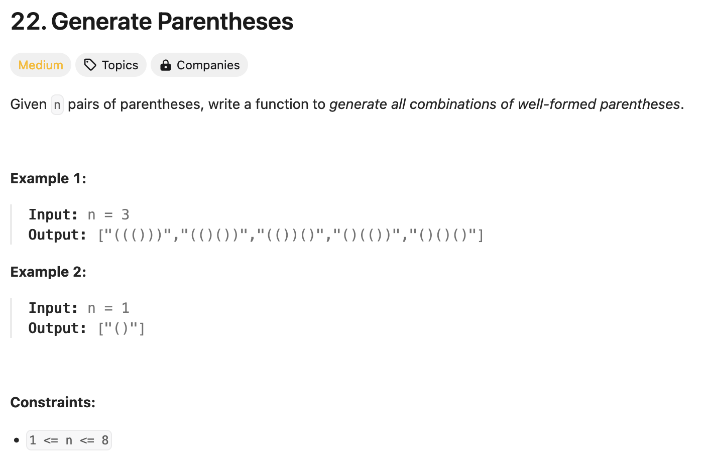

### solution
```go
func generateParenthesis(n int) []string {
    res := []string{}
    cur := make([]byte, n * 2)
    var dfs func(l, r int)
    dfs = func(l, r int) {
        if l + r == n * 2 {
            res = append(res ,string(cur))
            return
        }
        if l < n {
            cur[l+r] = '('
            dfs(l+1, r)
        }
        if r < l {
            cur[l+r] = ')'
            dfs(l, r+1)
        }
    }
    dfs(0, 0)
    return res
}
```