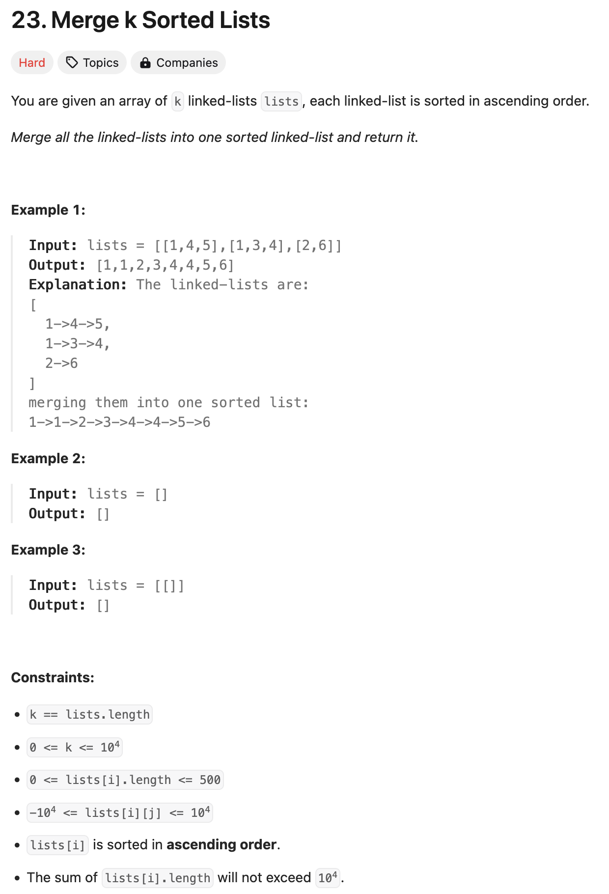

### solution
```go
func mergeKLists(lists []*ListNode) *ListNode {
	if lists == nil || len(lists) == 0 {
		return nil
	}

	for len(lists) > 1 {
		l1 := lists[0]
		l2 := lists[1]
		lists = lists[2:]

		merged := mergeTwoLists(l1, l2)
		lists = append(lists, merged)
	}

	return lists[0]
}

func mergeTwoLists(list1, list2 *ListNode) *ListNode {
	if list1 == nil {
		return list2
	}
	if list2 == nil {
		return list1
	}

	if list1.Val > list2.Val {
		list2.Next = mergeTwoLists(list2.Next, list1)
		return list2
	}
	list1.Next = mergeTwoLists(list1.Next, list2)
	return list1
}
```