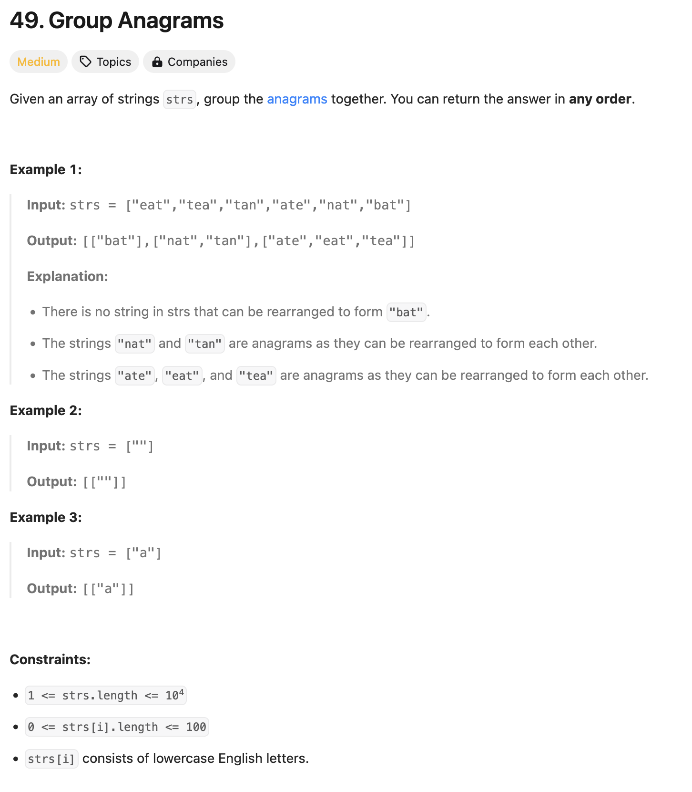

### solution
```go
func groupAnagrams(strs []string) [][]string {
    m := map[[26]byte][]string{} // мапа в которой ключ массив, а содержимое - слайс строк
    for _, v := range strs {
        k := [26]byte{}
        for _, c := range []byte(v) {
            k[c-'a']++
        }
        m[k] = append(m[k], v)
    }
    res := [][]string{}
    for _, v := range m {
        res = append(res, v)
    }
    return res
}
```