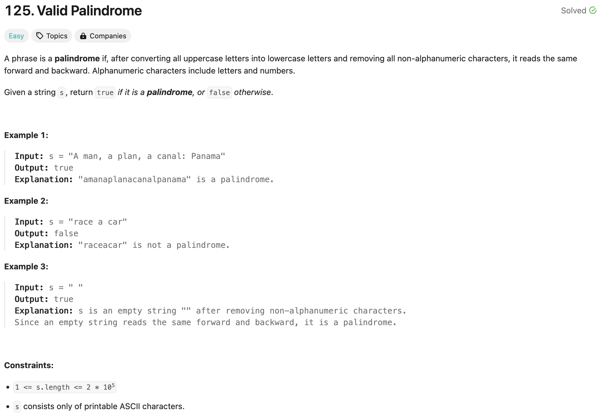

### solution
```go
func isPalindrome(s string) bool {
	l, r := 0, len(s)-1
	for r > l {
		for ; l < len(s) && !isAlphanumeric(s[l]); l++ {}
		for ; r >= 0 && !isAlphanumeric(s[r]); r-- {}
		if r >= 0 && l < len(s) && strings.ToLower(string(s[r])) != strings.ToLower(string(s[l])) {
			return false
		}
		r--
		l++
	}
	return true
}

func isAlphanumeric(c byte) bool {
	return (c >= 'A' && c <= 'Z') || (c >= 'a' && c <= 'z') || (c >= '0' && c <= '9')
}
```