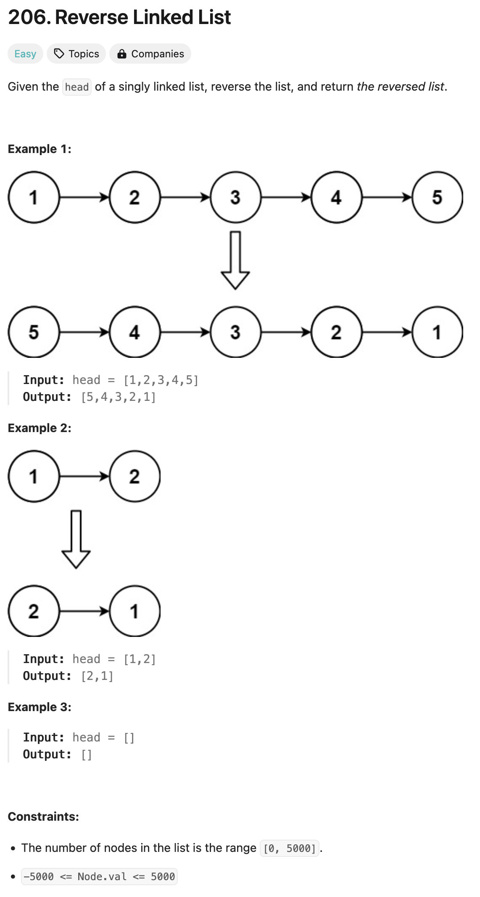

### solution
```go
func reverseList(head *ListNode) *ListNode {
    var prev *ListNode
    var tmp *ListNode
    for head != nil {
        tmp = head.Next
        head.Next = prev
        prev = head
        head = tmp
    }
    return prev
}
```