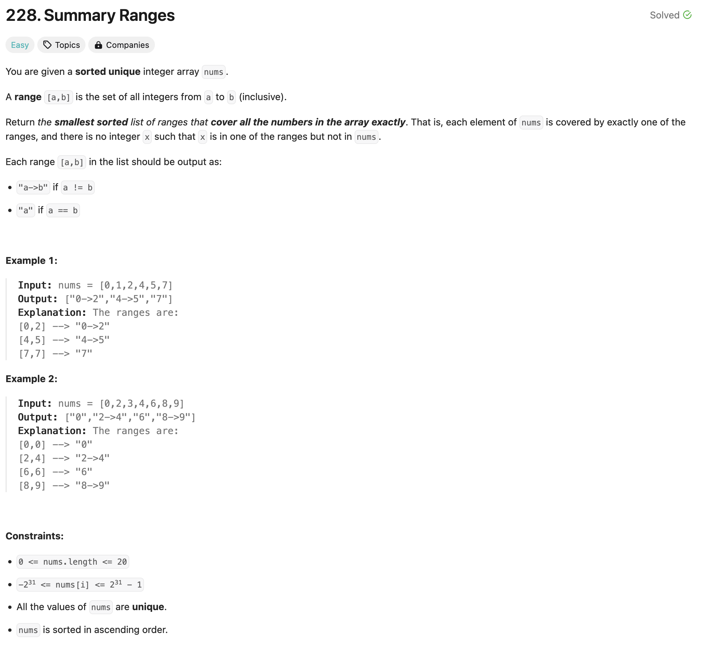

### solution
```go
func summaryRanges(nums []int) []string {
    res := []string{}
    for i := 0; i < len(nums); i++ {
        cur := nums[i]
        str := fmt.Sprintf("%d", cur)
        next := cur
        for j := i + 1; j < len(nums) && nums[j] - nums[j - 1] == 1; j++ {
            next = nums[j]
            i = j
        }
        if cur != next {
            str += fmt.Sprintf("->%d", next)
        }
        res = append(res, str)
    }
    return res
}
```