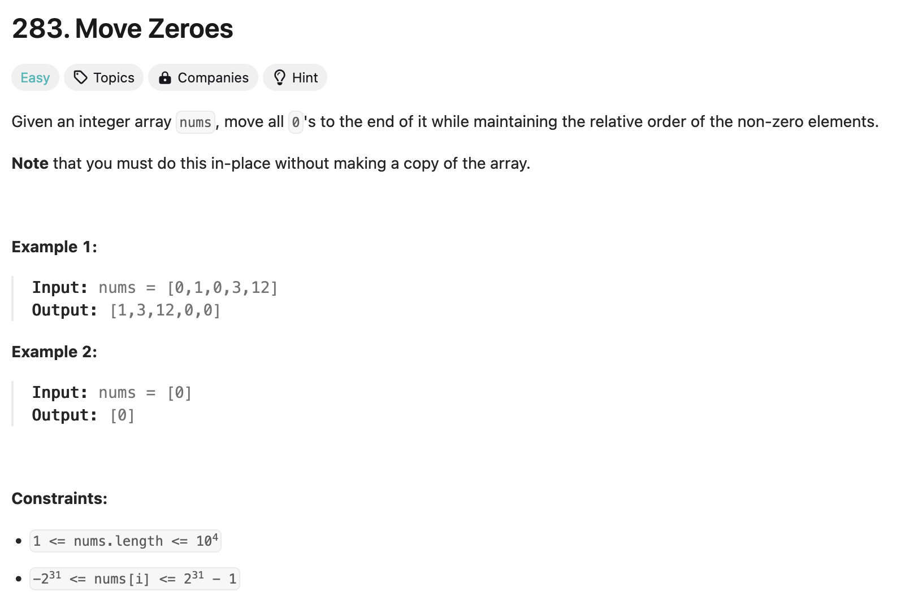

### solution
```go
func moveZeroes(nums []int)  {
    l, r := 0, 0
    for ;l < len(nums) && nums[l] != 0;l++ {}
    r = l
    for r < len(nums) {
        if nums[r] != 0 {
            nums[l], nums[r] = nums[r], nums[l] 
            l++
        }
        r++
    }
}
```