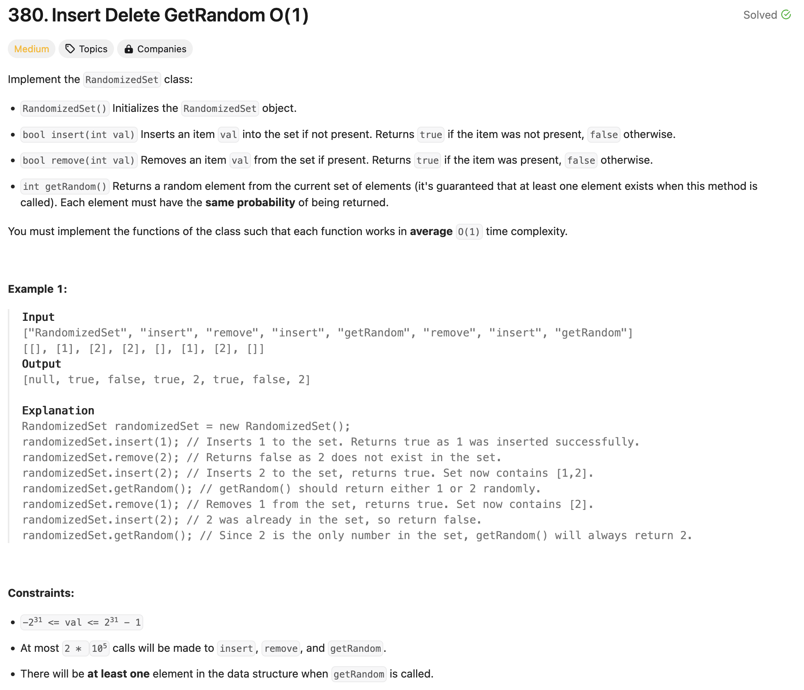

### solution
```go
type RandomizedSet struct {
    m map[int]int
    els []int
}


func Constructor() RandomizedSet {
    return RandomizedSet{
        m: map[int]int{},
        els: []int{},
    }
}


func (this *RandomizedSet) Insert(val int) bool {
    if _, ok := this.m[val]; ok {
        return false
    }
    this.els = append(this.els, val)
    this.m[val] = len(this.els) - 1
    return true
}


func (this *RandomizedSet) Remove(val int) bool {
    if _, ok := this.m[val]; !ok {
        return false
    }
    ind := this.m[val]
    tmp := this.els[len(this.els)-1]
    this.els[ind] = tmp
    this.els = this.els[:len(this.els)-1]
    this.m[tmp]=ind
    delete(this.m, val)

    return true
}


func (this *RandomizedSet) GetRandom() int {
    el := rand.Intn(len(this.els))
    return this.els[el]
}
```