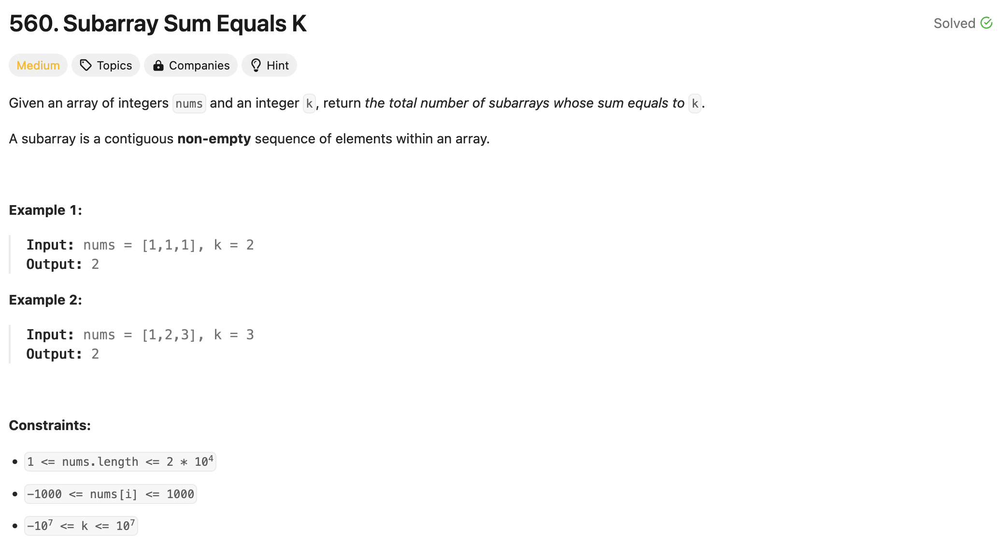

### solution
```go
func subarraySum(nums []int, k int) int {
    prefix, sum, count := map[int]int{0: 1}, 0, 0

    for _, v := range nums {
        sum += v
        count += prefix[sum-k]
        prefix[sum]++
    }
    return count
}
```