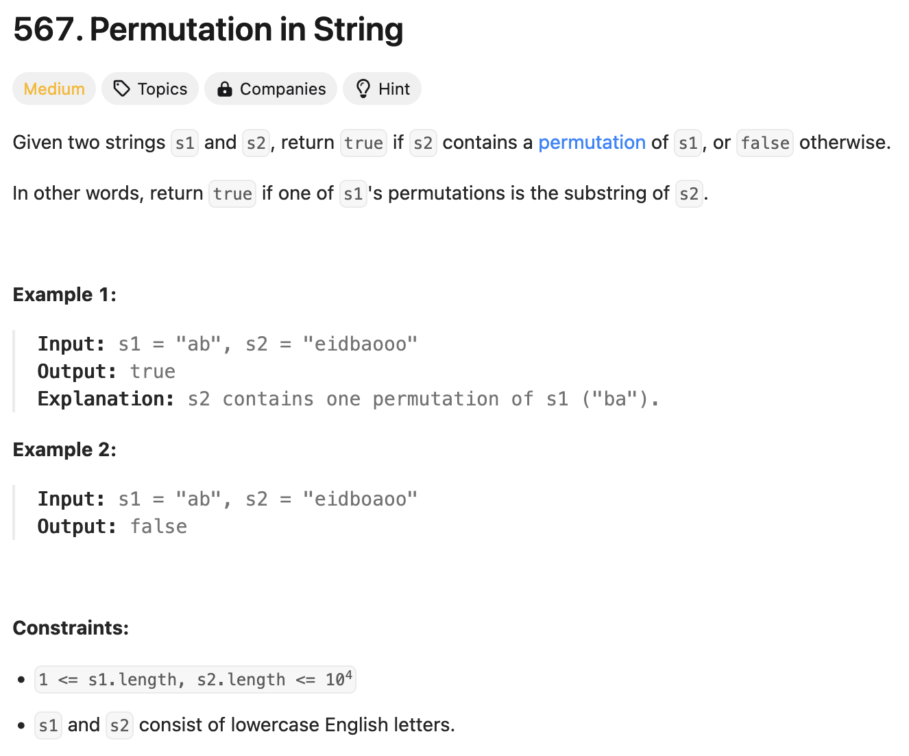

### solution
```go
func checkInclusion(s1 string, s2 string) bool {
    if len(s1) > len(s2) {
        return false
    }
    s1Count := make([]int, 26)
    s2Count := make([]int, 26)
    for i := 0; i < len(s1); i++ {
        s1Count[s1[i]-'a']++
        s2Count[s2[i]-'a']++
    }

    for i := 0; i < len(s2) - len(s1); i++ {
        if isMatch(s1Count, s2Count) {
            return true
        }
        s2Count[s2[i]-'a']--
        s2Count[s2[i+len(s1)]-'a']++
    }
    return isMatch(s1Count, s2Count)
}

func isMatch(m1, m2 []int) bool {
    for i := 0; i < len(m1); i++ {
        if m1[i] != m2[i] {
            return false
        }
    }
    return true
}
```