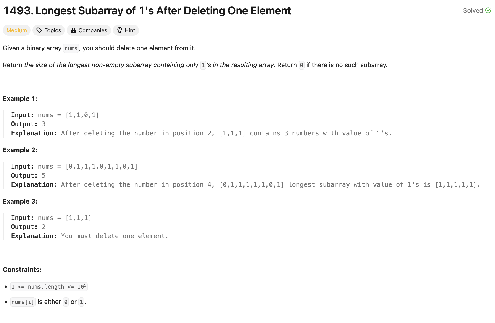

### solution
```go
func longestSubarray(nums []int) int {
	l, r, countZeroes := 0, 0, 0
	for ; r < len(nums); r++ {
		if nums[r] == 0 {
			countZeroes += 1
		}
		if countZeroes > 1 {
			if nums[l] == 0 {
				countZeroes--
			}
			l++
		}
	}
	return r - l - 1
}
```